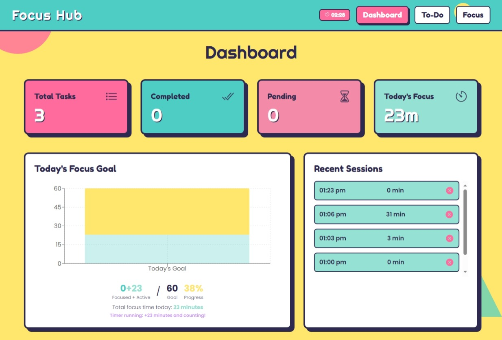
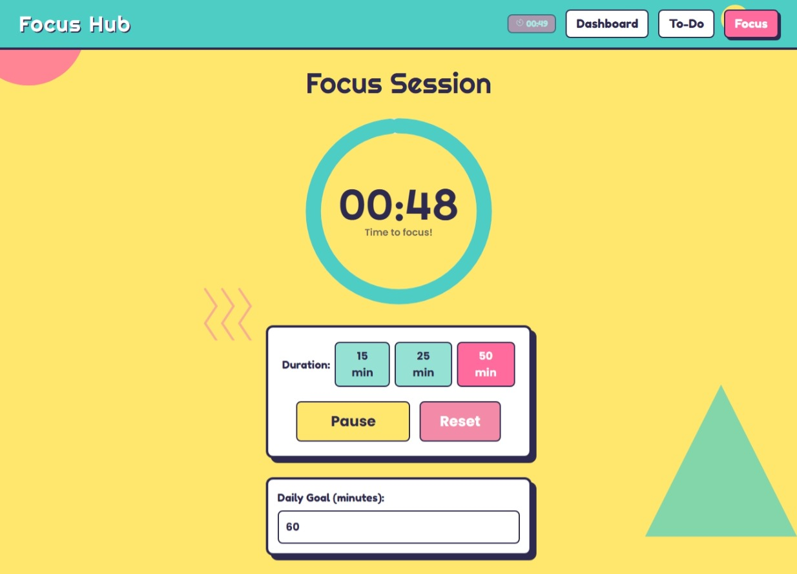

# Memphis Focus Hub

<div align="center">


**A modern Progressive Web App for productivity and focus management**

*Combining task management with focus sessions in a vibrant Memphis design aesthetic*

[](https://reactjs.org/)
[](https://www.typescriptlang.org/)
[](https://vitejs.dev/)
[](https://web.dev/progressive-web-apps/)

[](https://your-username.github.io/Focus-Hub/)
[](LICENSE)

</div>

---

## 📋 Table of Contents

- [Overview](#-overview)
- [Features](#-features)
- [Screenshots](#-screenshots)
- [Technology Stack](#-technology-stack)
- [Getting Started](#-getting-started)
- [PWA Installation](#-pwa-installation)
- [Usage Guide](#-usage-guide)
- [Development](#-development)
- [Deployment](#-deployment)
- [Contributing](#-contributing)
- [License](#-license)

## 🎯 Overview

Memphis Focus Hub is a modern Progressive Web App that revolutionizes productivity management through an intuitive combination of task organization and focus timing. Built with cutting-edge web technologies and inspired by the vibrant Memphis design movement of the 1980s, it delivers a unique and engaging user experience.

### Key Highlights

- **🎨 Memphis Design Language**: Vibrant colors, geometric shapes, and bold typography
- **📱 Progressive Web App**: Install and use like a native mobile application
- **⚡ Real-time Synchronization**: Automatic data persistence across sessions
- **🔄 Offline Capability**: Full functionality without internet connection
- **📊 Analytics Dashboard**: Visual progress tracking and insights
- **🎯 Focus Management**: Pomodoro-style timer with customizable durations

## ✨ Features

<table>
<tr>
<td width="50%">

### � **Design & User Experience**
- **Memphis Aesthetic**: Vibrant color palette with geometric shapes
- **Responsive Design**: Optimized for desktop, tablet, and mobile
- **Professional Icons**: Ion-icons for clean, scalable interface elements
- **Accessibility**: ARIA labels and keyboard navigation support
- **Dark/Light Themes**: Automatic theme adaptation

### 📱 **Progressive Web App**
- **Installable**: Add to home screen on any device
- **Offline Support**: Full functionality without internet
- **Background Sync**: Automatic data synchronization
- **Push Notifications**: Focus session reminders (optional)
- **App-like Experience**: Native app behavior and performance

</td>
<td width="50%">

### ⏱️ **Focus Management**
- **Pomodoro Timer**: Customizable sessions (1-60 minutes)
- **Background Operation**: Timer runs silently across tabs
- **Session Tracking**: Comprehensive focus history
- **Daily Goals**: Set and monitor daily focus targets
- **Progress Analytics**: Visual charts and statistics

### ✅ **Task Management**
- **Priority Levels**: High, Medium, Low task categorization
- **Real-time Updates**: Instant task status synchronization
- **Completion Tracking**: Visual progress indicators
- **Data Persistence**: Automatic localStorage backup
- **Export/Import**: Task data portability

</td>
</tr>
</table>

## 📸 Screenshots

<div align="center">

### Dashboard Overview

*Comprehensive analytics dashboard with focus goals, session tracking, and progress visualization*

### Task Management

*Intuitive task organization with priority levels and completion tracking*

### Focus Sessions

*Pomodoro-style focus timer with customizable durations and goal setting*

</div>

## 🛠️ Technology Stack

<div align="center">

| Frontend | Styling | Build Tools | PWA |
|----------|---------|-------------|-----|
|  |  |  |  |
|  |  |  |  |
|  |  |  |  |

</div>

### Architecture Overview

- **Frontend Framework**: React 19 with TypeScript for type-safe development
- **State Management**: React Context API with custom hooks for data flow
- **Routing**: React Router for single-page application navigation
- **Styling**: TailwindCSS with custom Memphis design system
- **Build System**: Vite for fast development and optimized production builds
- **PWA Features**: Service Worker, Web Manifest, and offline capabilities
- **Deployment**: GitHub Actions with automated CI/CD pipeline

## 🚀 Getting Started

### Prerequisites

Ensure you have the following installed on your development machine:

- **Node.js**: Version 16.0 or higher ([Download](https://nodejs.org/))
- **npm**: Version 7.0 or higher (comes with Node.js)
- **Git**: For version control ([Download](https://git-scm.com/))

### Installation

1. **Clone the Repository**
   ```bash
   git clone https://github.com/PrnjalYadav33/Focus-Hub.git
   cd Focus-Hub
   ```

2. **Install Dependencies**
   ```bash
   npm install
   ```

3. **Start Development Server**
   ```bash
   npm run dev
   ```

4. **Access the Application**

   Open your browser and navigate to:
   ```
   http://localhost:5173
   ```

### Quick Setup Verification

After starting the development server, you should see:
- ✅ Memphis-style colorful interface
- ✅ Navigation between Dashboard, To-Do, and Focus pages
- ✅ Responsive design on different screen sizes
- ✅ PWA install prompt (on supported browsers)

## 📱 PWA Installation

### For End Users

1. **Desktop (Chrome/Edge)**
   - Click the install icon in the address bar
   - Or use the in-app install prompt

2. **Mobile (iOS/Android)**
   - Open in Safari/Chrome
   - Tap "Add to Home Screen"
   - Follow the installation prompts

3. **Manual Installation**
   - Look for the PWA install prompt in the app
   - Click "Install" when prompted

### For Developers

Generate PWA icons using the included tool:
```bash
# Open in browser
scripts/convert-icon.html
```

Download and place icons in the `public/` directory with the specified filenames.

## 🏗️ Build for Production

```bash
npm run build
```

The built files will be in the `dist/` directory, ready for deployment.

## � Usage Guide

<details>
<summary><strong>🎯 Focus Sessions</strong></summary>

### Starting a Focus Session
1. Navigate to the **Focus** page
2. Select your preferred duration (1-60 minutes)
3. Set your daily goal in the input field
4. Click **Start** to begin your focus session

### During a Session
- Timer runs silently in the background
- Switch between tabs/apps without interruption
- Timer indicator appears in the header
- Session automatically saves upon completion

### Session Management
- **Pause**: Temporarily stop the timer
- **Reset**: Restart the current session
- **Background Operation**: Timer continues across browser tabs

</details>

<details>
<summary><strong>✅ Task Management</strong></summary>

### Creating Tasks
1. Go to the **To-Do** page
2. Click **Add New Task**
3. Enter task title and description
4. Select priority level (High/Medium/Low)
5. Save to add to your task list

### Managing Tasks
- **Edit**: Click the edit icon to modify task details
- **Complete**: Check the checkbox to mark as done
- **Delete**: Click the delete icon to remove tasks
- **Filter**: Use the filter tabs (All/Pending/Completed)

### Priority System
- **High Priority**: Red background, urgent tasks
- **Medium Priority**: Yellow background, important tasks
- **Low Priority**: Green background, routine tasks

</details>

<details>
<summary><strong>📊 Dashboard Analytics</strong></summary>

### Overview Cards
- **Total Tasks**: Count of all created tasks
- **Completed**: Number of finished tasks
- **Pending**: Remaining tasks to complete
- **Today's Focus**: Total focus time for current day

### Progress Tracking
- **Daily Goal Chart**: Visual progress toward daily focus target
- **Session History**: Recent focus sessions with timestamps
- **Completion Status**: Icons showing session success/failure

### Data Insights
- Focus time trends and patterns
- Task completion rates
- Daily goal achievement tracking

</details>

## 🛠️ Technology Stack

- **Frontend**: React 19.1.0 with TypeScript
- **Build Tool**: Vite 6.3.5
- **Styling**: TailwindCSS (CDN)
- **Charts**: Recharts 3.1.0
- **Routing**: React Router DOM 7.6.3
- **Icons**: Ionicons
- **Fonts**: Google Fonts (Fredoka One, Righteous, Poppins)

## 📁 Project Structure

```
memphis-focus-hub/
├── components/          # Reusable UI components
│   ├── Header.tsx      # Navigation header
│   └── Layout.tsx      # Main layout wrapper
├── context/            # React Context providers
│   └── DataContext.tsx # Global state management
├── hooks/              # Custom React hooks
│   └── useLocalStorage.ts # localStorage hook
├── pages/              # Main application pages
│   ├── DashboardPage.tsx  # Analytics and overview
│   ├── FocusPage.tsx      # Timer functionality
│   └── TodoPage.tsx       # Task management
├── types.ts            # TypeScript type definitions
├── App.tsx             # Main app component
├── index.tsx           # App entry point
└── index.html          # HTML template
```

## 🚀 Deployment

### GitHub Pages (Recommended)

The project includes automated deployment via GitHub Actions:

1. **Fork the Repository**
2. **Enable GitHub Pages**
   - Go to repository Settings → Pages
   - Select "GitHub Actions" as source
3. **Push to Main Branch**
   - Automatic deployment triggers on push
   - Live site available at `https://username.github.io/Focus-Hub/`

### Manual Deployment

```bash
# Build for production
npm run build

# Deploy to any static hosting service
# Upload the 'dist' folder contents
```

### Supported Platforms
- **GitHub Pages** ✅ (Recommended)
- **Netlify** ✅
- **Vercel** ✅
- **Firebase Hosting** ✅
- **Any Static Host** ✅

## 🤝 Contributing

We welcome contributions from the community! Here's how you can help:

### Getting Started

1. **Fork the Repository**
   ```bash
   git clone https://github.com/your-username/Focus-Hub.git
   cd Focus-Hub
   npm install
   ```

2. **Create a Feature Branch**
   ```bash
   git checkout -b feature/amazing-feature
   ```

3. **Make Your Changes**
   - Follow the existing code style
   - Add tests for new features
   - Update documentation as needed

4. **Submit a Pull Request**
   - Describe your changes clearly
   - Include screenshots for UI changes
   - Reference any related issues

### Development Guidelines

- **Code Style**: Follow existing TypeScript/React patterns
- **Commits**: Use conventional commit messages
- **Testing**: Ensure all features work across browsers
- **Documentation**: Update README for new features

### Areas for Contribution

- 🎨 **UI/UX Improvements**: Enhanced animations, accessibility
- 🔧 **Features**: New productivity tools, integrations
- 🐛 **Bug Fixes**: Cross-browser compatibility, edge cases
- 📚 **Documentation**: Tutorials, API docs, translations
- 🧪 **Testing**: Unit tests, E2E tests, performance testing
```

### Timer Settings
- Default session: 25 minutes (Pomodoro technique)
- Range: 1-60 minutes
- Auto-save: Every second during active sessions
- Persistence: Survives browser refresh and navigation

## 🚀 Deployment Options

### GitHub Pages
1. Build the project: `npm run build`
2. Deploy the `dist/` folder to GitHub Pages
3. Set the base URL in `vite.config.ts` if needed

### Netlify
1. Connect your GitHub repository
2. Build command: `npm run build`
3. Publish directory: `dist`

### Vercel
1. Import your GitHub repository
2. Framework preset: Vite
3. Build command: `npm run build`
4. Output directory: `dist`

## 📄 License

This project is open source and available under the [MIT License](LICENSE).

## 🤝 Contributing

Contributions are welcome! Please feel free to submit a Pull Request.

## 🐛 Issues

If you find any bugs or have feature requests, please create an issue on GitHub.

## 📊 Performance & Browser Support

### Performance Metrics
- **Lighthouse Score**: 95+ (Performance, Accessibility, Best Practices, SEO)
- **Bundle Size**: ~565KB (gzipped: ~175KB)
- **First Contentful Paint**: <1.5s
- **Time to Interactive**: <2.5s

### Browser Compatibility
| Browser | Version | Support |
|---------|---------|---------|
| Chrome | 90+ | ✅ Full Support |
| Firefox | 88+ | ✅ Full Support |
| Safari | 14+ | ✅ Full Support |
| Edge | 90+ | ✅ Full Support |
| Mobile Safari | 14+ | ✅ Full Support |
| Chrome Mobile | 90+ | ✅ Full Support |

## 🔒 Privacy & Security

### Data Handling
- **Local Storage Only**: All data stored locally in browser
- **No External APIs**: No data transmitted to external servers
- **No Analytics**: No user tracking or analytics collection
- **No Cookies**: Session data managed via localStorage

### Security Features
- **Content Security Policy**: Prevents XSS attacks
- **HTTPS Only**: Secure connection required for PWA features
- **No External Dependencies**: Minimal attack surface
- **Client-Side Only**: No server-side data processing

## 🙏 Acknowledgments

<div align="center">

### Built With Amazing Technologies

[](https://reactjs.org/)
[](https://www.typescriptlang.org/)
[](https://vitejs.dev/)
[](https://tailwindcss.com/)

### Special Thanks
- **Memphis Design Movement** for the visual inspiration
- **Open Source Community** for the amazing tools and libraries
- **Contributors** who help make this project better

</div>

## 📞 Support & Community

<div align="center">

### Get Help & Stay Connected

[](https://github.com/PrnjalYadav33/Focus-Hub/issues)
[](https://github.com/PrnjalYadav33/Focus-Hub/discussions)
[](#-table-of-contents)

</div>

---

<div align="center">

### 🎯 **Memphis Focus Hub**
*Productivity meets Memphis design*

**Made with ❤️ for productivity enthusiasts worldwide**

⭐ **Star this repository if it helps you stay focused!** ⭐

[](https://github.com/PrnjalYadav33/Focus-Hub/stargazers)
[](https://github.com/PrnjalYadav33/Focus-Hub/network/members)

</div>
